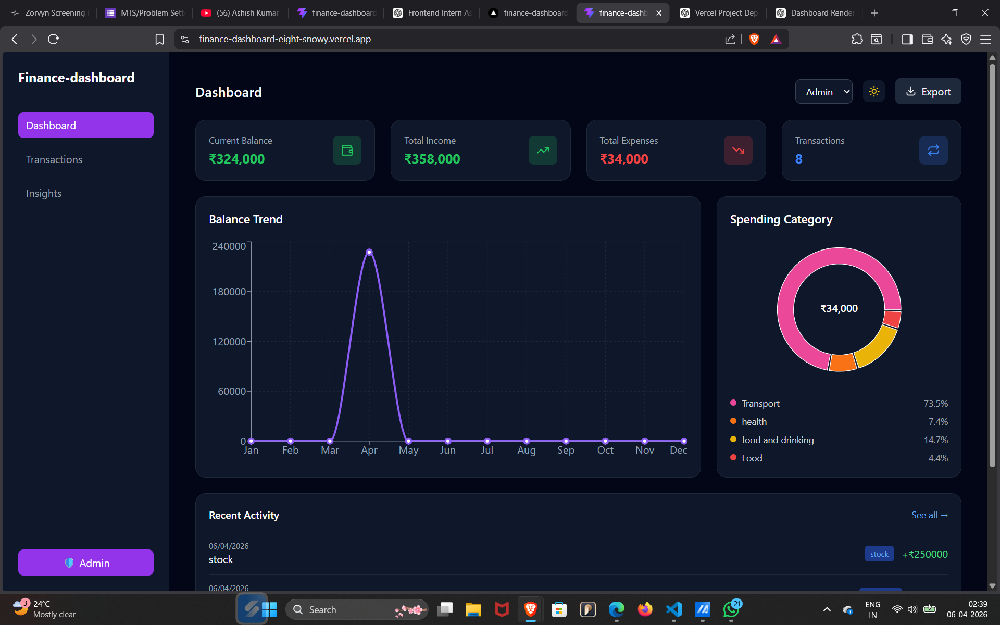
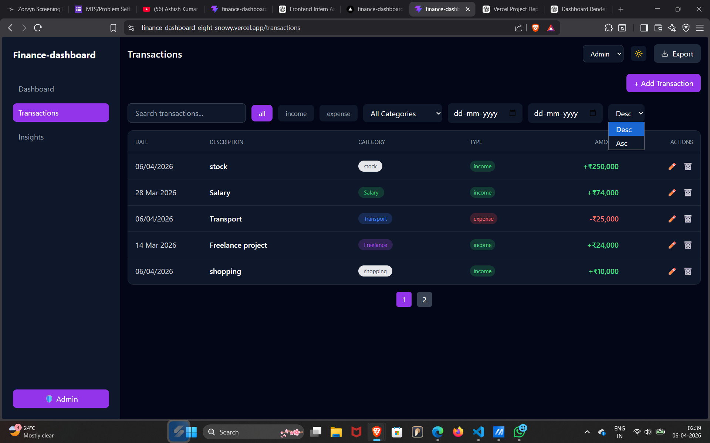
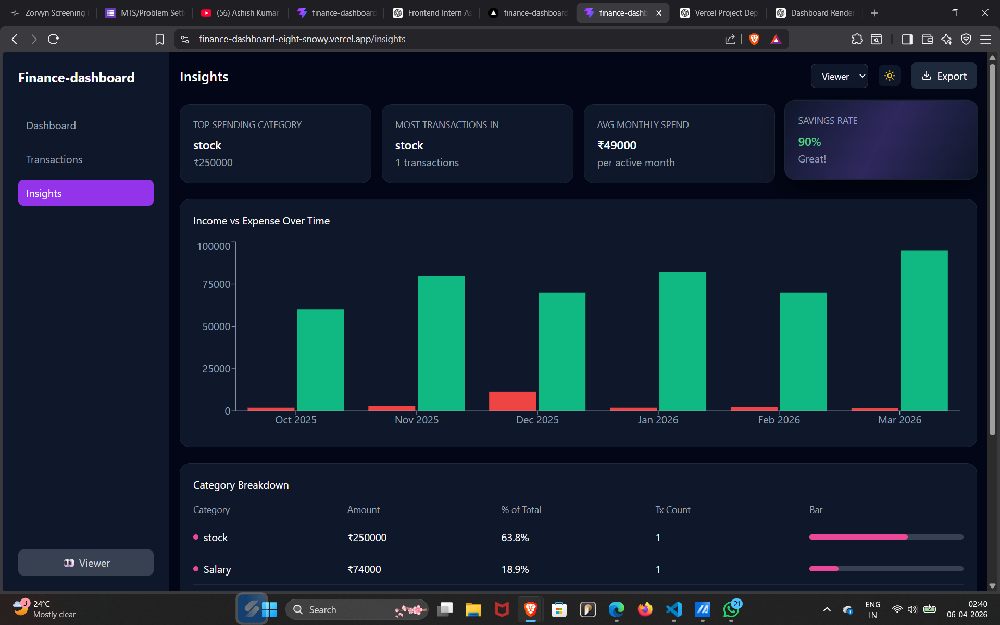

# 💰 Finance Dashboard UI

This project is a **Finance Dashboard UI** built as part of the **Frontend Developer Intern assignment** for **Zorvyn FinTech Pvt. Ltd.**

The goal of this project is to demonstrate frontend development skills including **UI design, component structuring, state management, and data handling** using a clean and interactive interface.

---

## 🚀 Live Demo

🔗 https://finance-dashboard-eight-snowy.vercel.app/

---
## 📸 Screenshots

### Dashboard


### Transactions


### Insights


## 📌 Objective

To build a simple and intuitive dashboard that allows users to:

- View overall financial summary  
- Explore transactions  
- Understand spending patterns  

This project focuses purely on **frontend implementation using mock/local data**.

---

## 🧠 Approach

- Designed a clean and modern dashboard layout using **Tailwind CSS**
- Structured the project into **reusable components**
- Used **Context API** for global state management
- Implemented interactive charts using **Recharts**
- Focused on **usability, responsiveness, and clarity**

---

## ✅ Core Features (As per Assignment)

### 📊 1. Dashboard Overview

- Summary cards:
  - Total Balance  
  - Total Income  
  - Total Expenses  

- Time-based visualization:
  - Monthly balance trend (Line Chart)

- Category-based visualization:
  - Spending breakdown (Donut Chart)

---

### 💸 2. Transactions Section

Transaction list with:

- Date  
- Title  
- Category  
- Type (Income/Expense)  
- Amount  

**Features:**

- Search functionality  
- Filter (All / Income / Expense)  
- Category filter  
- Date range filter  
- Sorting (Ascending / Descending)  
- Pagination  

---

### 👤 3. Role-Based UI (Frontend Simulation)

- **Admin**
  - Can add, edit, and delete transactions  

- **Viewer**
  - Read-only access  

- Role switching implemented using a dropdown  

---

### 📈 4. Insights Section

- Top spending category  
- Most used category  
- Average spending  
- Savings rate  
- Monthly income vs expense comparison  
- Category-wise breakdown with percentages  

---

### 🧩 5. State Management

Managed using **React Context API**

Handles:

- Transactions data  
- Filters  
- User role  

---

### 🎨 6. UI/UX Considerations

- Clean and readable design  
- Responsive layout (desktop-friendly)  
- Handles empty states gracefully  
- Consistent spacing and color system  

---

## ✨ Optional Enhancements Implemented

- 🌙 Dark / Light mode (with persistence)  
- 💾 LocalStorage (data persistence)  
- 📤 Export transactions as CSV  
- 🎞️ Smooth animations (Framer Motion)  
- 🔍 Advanced filtering & search  

---

## 🛠️ Tech Stack

- React (Vite)  
- Tailwind CSS  
- Recharts  
- Framer Motion  
- Context API  
- LocalStorage  

---

## ⚙️ Setup Instructions

```bash
git clone https://github.com/your-username/finance-dashboard.git
cd finance-dashboard
npm install
npm run dev
```

## 📁 Project Structure
src/
│
├── components/
│   ├── dashboard/
│   │   ├── CategoryChart.jsx
│   │   ├── MetricCards.jsx
│   │   ├── RecentTransactions.jsx
│   │   └── TrendChart.jsx
│   │
│   ├── insights/
│   │   └── InsightCards.jsx
│   │
│   ├── layout/
│   │   ├── Sidebar.jsx
│   │   └── Topbar.jsx
│   │
│   ├── transactions/
│   │   ├── Filters.jsx
│   │   ├── TransactionModal.jsx
│   │   └── TransactionTable.jsx
│
├── hooks/
│   └── useFinance.jsx
│
├── pages/
│   ├── Dashboard.jsx
│   ├── Transactions.jsx
│   └── Insights.jsx
│
├── App.jsx
├── main.jsx
└── index.css


## 📝 Notes

- This project uses mock/local data (no backend)  
- Focus is on frontend logic, UI, and interaction design  
- Insights are dynamically calculated from transaction data

## 🙌 Author

Vinay Pal
Frontend Developer Intern Applicant

## 📎 Submission
- 🔗 **GitHub Repository:**  
  [Click Here](https://github.com/vinay7376/finance-dashboard)

- 🌐 **Live Demo:**  
  [View Project](https://finance-dashboard-eight-snowy.vercel.app/)

## ⭐ Final Note

This project reflects my approach to building a **clean, functional, and user-friendly frontend application** while keeping the implementation simple and scalable.